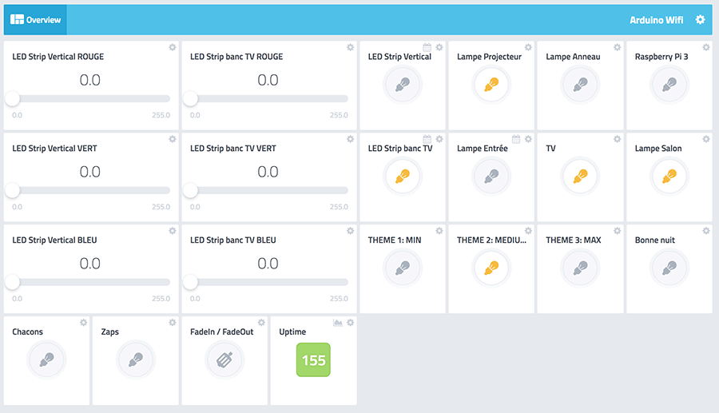
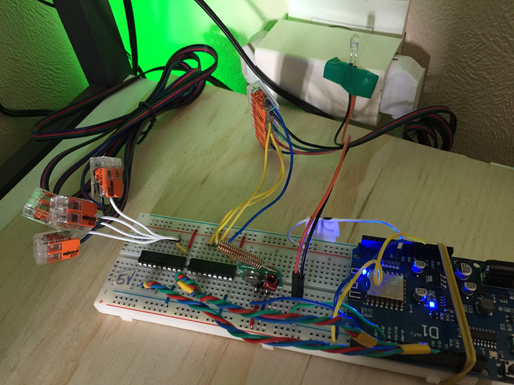
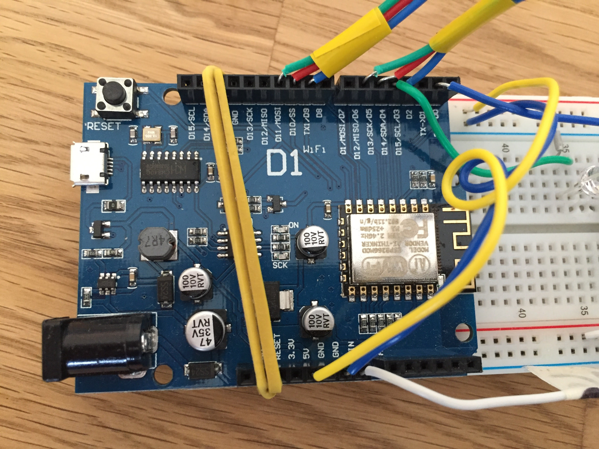

# Tuto 6: How to control 2 LED strips + send 433MHz RF codes + IR with Cayenne ?

## Demo

How to control 2 RGB LED strips + turn on / off 433MHz power outlet with Cayenne dashboard + IR transmitter

Example for turning on / off Chacon & Zap power outlet with Cayenne dashboard

Please get your personal remote codes from TP3_433MHz_Receiver and add them to "Chacon power outlet codes" section.

Update:
  This sketch sends IR codes to control devices
  
- Samsung TV
- Sony speaker system 
- LED Strip with IR receiver
- and all other IR devices (Working with a simple IR remote control)
 


## Requirements

- 2 RGB 5050 LED Strips
- 433MHz power outlet (Chacon & Zap)
- 433MHz transmitter
- 1 IR LED
- Arduino Ethernet shield or 
- Wemos D1 Wifi (based on esp8266) or
- Arduino wifi esp8266 module
- 9V / 12V external power supply
- Wago connectors
- 2 ULN2803

## Wiring

| 433 Transmitter | Wemos D1 (ESP8266)   
|-----------------|-------------------
| VCC             | 5V (Arduino 5V)        
| GND             | GND       
| DATA            | D1 

| ULN2803 1   | Wemos D1 (ESP8266)   
|-------------|----------------------------
| VIN         | 12V (External power supply)
| GND         | GND       
| BLUE        | D3 
| RED         | D5 
| GREEN       | D6

| ULN2803 2   | Wemos D1 (ESP8266)   
|-------------|----------------------------
| VIN         | 12V (External power supply)
| GND         | GND       
| BLUE        | D9 
| RED         | D10 
| GREEN       | D11 

| IR LED | Wemos D1 (ESP8266)   
|--------|-------------------
| -      | GND       
| +      | D4 

| 433MHz power outlet   | Device   
|-----------------------|--------------------
| Zap 1                 | Living room lamp 1
| Zap 2                 | Kitchen lamp
| Zap 3                 | Green room lamp
| Zap 4                 | TV
| Chacon 2              | Raspberry pi
| Chacon 3              | Living room lamp 2
| Chacon 4              | Red room lamp






## Configuration

Please get your personal remote codes from [TP3 433MHz Receiver](../TP3_433MHz_Receiver) and add them to "Chacon power outlet codes" section.
  
```
/!\ Please get your personal remote codes from TP3_433MHz_Receiver.
/!\ Please insert your custom Token (Your Cayenne account).
/!\ Please insert your custom SSID + Password (Your wifi credentials).
```

Update this line with your custom values

```c
char token[] = "XXXXXXXXXXXXXXXX";   // /!\ Enter your Cayenne token here
char ssid[] = "XXXXXXXXXXXXXXXXX";   // /!\ Enter your Wifi name here
char password[] = "XXXXXXXXXXXXX";   // /!\ Enter your Wifi password here
```

and create this virtal pins in your Cayenne dashboard

```c
#define VIRTUAL_PIN_0 V0    //uptime
#define VIRTUAL_PIN_1 V1    //led1 on/off
#define VIRTUAL_PIN_2 V2    //led2 on/off

#define VIRTUAL_PIN_3 V3    //led strip 1 R
#define VIRTUAL_PIN_4 V4    //led strip 1 G
#define VIRTUAL_PIN_5 V5    //led strip 1 B

#define VIRTUAL_PIN_6 V6    //led strip 2 R
#define VIRTUAL_PIN_7 V7    //led strip 2 G
#define VIRTUAL_PIN_8 V8    //led strip 2 B

//Chacon
#define VIRTUAL_PIN_9 V9    //Chacon2
#define VIRTUAL_PIN_10 V10  //Chacon3
#define VIRTUAL_PIN_11 V11  //Chacon4

//Zap
#define VIRTUAL_PIN_12 V12  //Zap1
#define VIRTUAL_PIN_13 V13  //Zap2
#define VIRTUAL_PIN_14 V14  //Zap3
#define VIRTUAL_PIN_15 V15  //Zap4

//All 
#define VIRTUAL_PIN_16 V16  //turn on/off all Chacon + Zap
#define VIRTUAL_PIN_17 V17  //turn on/off all Zap
#define VIRTUAL_PIN_18 V18  //turn on/off all Chacon

//Fade mode
#define VIRTUAL_PIN_19 V19  //turn on/off LED strip fade mode

//Brightness themes to turn on power outlets
#define VIRTUAL_PIN_20 V20  //theme 1: min brightness
#define VIRTUAL_PIN_21 V21  //theme 2: medium brightness
#define VIRTUAL_PIN_22 V22  //theme 3: max brightness
```

Update this lines with your custom remote codes

```c
/*
 * 433MHz CUSTOM FUNCTIONS
 */

void chacon2_on(){
  mySwitch.sendTriState("0FFFF0FFFFFF"); 
}
...
```