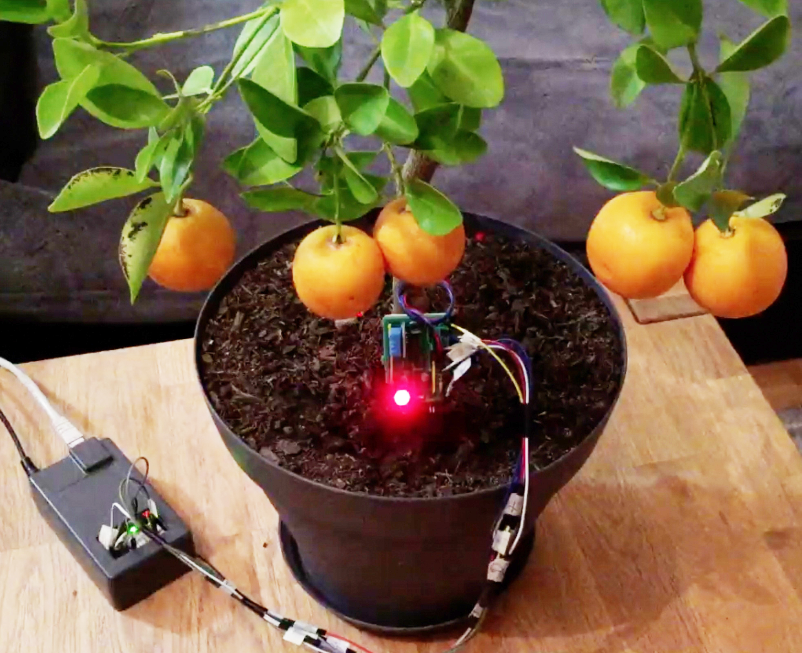

# Tuto 7: How to make a Flower Power like for your plants ?

## Demo

This [Flower Power](http://global.parrot.com/au/products/flower-power/) hack monitors and analyzes the four parameters essential to your plant's health into Cayenne dashboard.

4 in 1 Flower Power : Temperature + Brightness + Soil moisture + Humidity


## Requirements

  - 1 LED
  - 1 Photoresistor (for brightness)
  - 1 DHT11 (for temperature + humidity)
  - 1 Water sensor (for soil moisture)
  - 1 Arduino UNO
  - 1 Ethernet shield
  - 2 Resistors
  - 1 9V external power supply
  - Jumpers / Breadboards

## Wiring

| LED   | Arduino   
|-------|-------
| VCC   | 5V       
| GND   | GND       
| DATA  | D2 
  
| DHT11 | Arduino   
|-------|-------
| VCC   | 5V       
| GND   | GND       
| DATA  | A1 

| Water sensor | Arduino   
|--------------|-------
| VCC          | 5V      
| GND          | GND       
| DATA         | A2 

| Photoresistor | Arduino   
|---------------|-------
| VCC           | 5V        
| GND           | GND       
| DATA          | A0 




## Video

[](https://www.youtube.com/watch?v=DpATZUCZu0Q)

## Configuration

Update this line with your custom values

```c
char token[] = "XXXXXXXXXXXXXXXX";   // /!\ Enter your Cayenne token here
```

and create this virtal pins in your Cayenne dashboard

```c
#define VIRTUAL_PIN_1 V1   //temperature
#define VIRTUAL_PIN_2 V2   //uptime
#define VIRTUAL_PIN_3 V3   //water sensor
#define VIRTUAL_PIN_4 V4   //humidity
#define VIRTUAL_PIN_12 V12 //brightness
```

## Shopping

- 1 LED = 0.20 €
- 1 Photoresistor (for brightness) = 0.59 €
- 1 DHT11 (for temperature + humidity) = 2.20 €
- 1 Water sensor (for soil moisture) = 2.50 €
- 2 Resistors = 0.20 €

Total price: 5.69 €

- 1 Arduino UNO "like"
- 1 Ethernet shield
- 1 9V external power supply
- Jumpers / Breadboards

